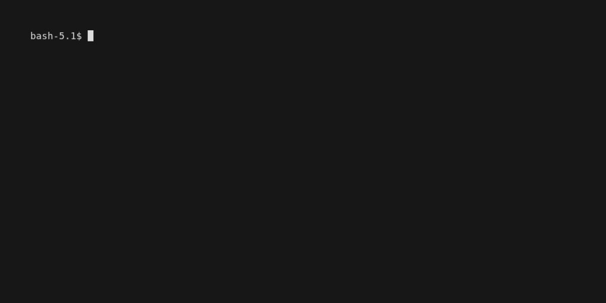

# Tatoeba Sentence Grabber
## Description
Somewhat shaky interface to get sentences from Tatoeba. Uses their API, use politely.

## REPL Demo


## Usage
### Setup this repo
1. Clone this repo
2. Install [pipenv](https://pypi.org/project/pipenv/)
3. Run `pipenv install`

(Or use your preferred python dependency manager)

### Run the script

```bash
Usage: tatoeba-sentences.py [OPTIONS]

Options:
  -i, --input_file TEXT  File to read the words from, one word per line.
  --repl                 Open a REPL to query one word at a time. Default.
  --help                 Show this message and exit.
```

See [the exmaple input file](./data/input_test.txt) for the format.

## Disclaimer
I wrote this in a few hours, use at your risk!

## Acknowledgements
Thank you [Tatoeba](https://tatoeba.org/en/) for the sentences and API.
Tatoeba content available under [Creative Commons Attribution 2.0 license (CC-BY 2.0)](https://creativecommons.org/licenses/by/2.0/).

## TODO
- [ ] Improve the choice formatting
- [ ] Handle too-long choices
